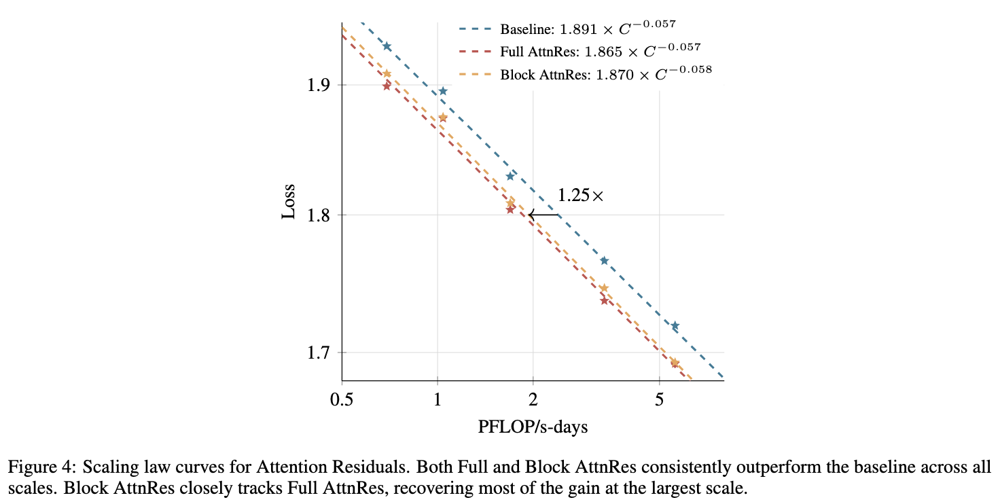
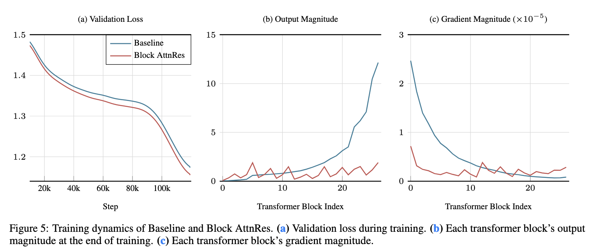

# Attension Residuals in one file.

A clean, single-file Pytorch implementation of **Attention Residuals**.

The repo exists for a simple reason: the paper is interesting, the mechanism is useful and most people do **not** want to dig through huge training stack just to change one piece of residual.

Have kept the implementation:

- small enough to go through and test
- simple enough to copy into your own model

If you just want the code, copy `attn_residual.py` into your project.
If you want it as a module `pip install -e .` and import it normally

> Paper: **Attention Residuals**
> arXiv: `2603.15031`  
> Official repo: MoonshotAI/Attention-Residuals





## Why is it interesting

Standard PreNorm residuals keep adding every layer output with fixed weight `1`.

AttnRes changes that. Each layer gets a learned pseudo-query and pulls from earlier depth states with a **softmax over depth** instead of a blind sum. In the paper, that change improves scaling behavior, helps on reasoning and code benchmarks, and keeps hidden-state growth better behaved.

The practical version is Block AttnRes:

- keep normal residual accumulation inside a small block
- attend only across completed block summaries
- uses the two-phase computation to keep overhead low

## What is in this repo

- Full AttnRes
- Block AttnRes
- the two phase Block AttnRes merge

For most of it, the above's all that's needed but this repo also has a tiny GPT-style `AttnResTransformer`, a `smoke.py` for quick sanity checks and more...

Note: this is just a reference implementation.

## Install

```bash
git clone https://github.com/KartikVashishta/attention-residuals.git
cd attention-residual
pip install -e .
```

If you only want the implementation, just do the following

```python
from attn_residual import BlockAttnResStack, FullAttnResStack, AttnResTransformer
```

## Quick Start

```python
import torch
from attn_residuals import AttnResTransformer

model = AttnResTransformer(
    num_tokens = 32000,
    dim = 512,
    depth = 12,
    max_seq_len = 2048,
    heads = 8,
    dim_head = 64,
    ff_mult = 4,
    attnres = 'block',
    block_size = 8,
)

ids = torch.randint(0, 32000, (2, 128))
logits = model(ids)
print(logits.shape)  # (2, 128, 32000)
```

## Choosing Full vs Block

### Use **block attnres** when

- you want the practical version and you care about keeping memory under control
- you want the version closest to what you would actually scale

### Use **full attnres** when

- you want the cleanest conceptual version and you are just doing ablations
- you want an exact reference for correctness checks

## One detail that matters a lot

`block_size` is measured in **atomic layers** not logical transformer blocks.

So if your backbone alternates:

- attention
- MLP

then one transformer block = **2 atomic layers**.

That means:

- `block_size=8` means **4 transformer blocks**
- `block_size=6` means **3 transformer blocks**

## Citation

```bibtex
@misc{chen2026attentionresiduals,
  title        = {Attention Residuals},
  author       = {Kimi Team and Guangyu Chen and Yu Zhang and Jianlin Su and Weixin Xu and Siyuan Pan and Yaoyu Wang and Yucheng Wang and Guanduo Chen and others},
  year         = {2026},
  eprint       = {2603.15031},
  archivePrefix= {arXiv},
  primaryClass = {cs.LG}
}
```
