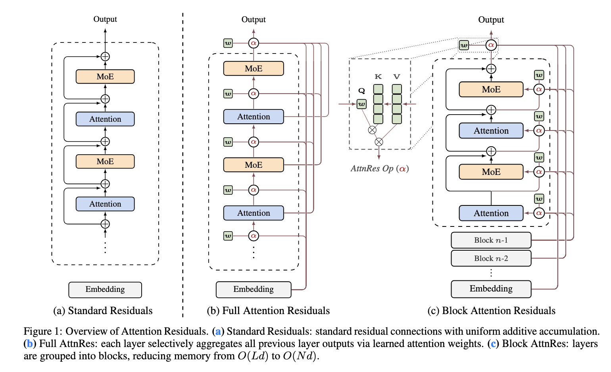
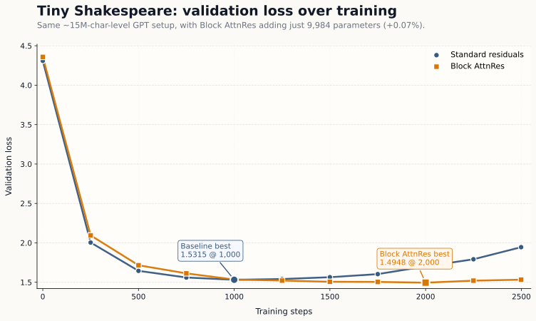

# Attention Residuals in one file

A compact PyTorch reference implementation of **Attention Residuals** that you can read in one sitting, test quickly, and copy into a real model without dragging in a full training stack.

This repo is intentionally small:

- `attn_residuals.py` contains the core implementation
- `smoke.py` is a quick sanity check
- `train_shakespeare.py` is a small GPT-style experiment on Tiny Shakespeare
- `assets/` holds paper figures plus a reproduced training chart from this repo

If you only want the implementation, copy [`attn_residuals.py`](attn_residuals.py) into your project and import from there.

> Paper: **Attention Residuals**
> arXiv: `2603.15031`  
> Official repo: [MoonshotAI/Attention-Residuals](https://github.com/MoonshotAI/Attention-Residuals)



## What AttnRes changes

Standard PreNorm transformers add each layer output back with a fixed residual weight of `1`.

Attention Residuals replace that blind accumulation with a learned depth-wise read. Each layer gets a pseudo-query and attends over earlier hidden states with a **softmax over depth**. The paper's practical version, **Block AttnRes**, keeps the idea while limiting the attention scope to completed blocks so the overhead stays manageable.

In plain terms, this gives you:

- a learned way to reuse earlier depth states instead of summing everything equally
- better control over hidden-state growth
- a version that is still simple enough to drop into a normal GPT-style stack

## What is implemented here

This repo includes:

- `FullAttnResStack`: the cleanest reference version
- `BlockAttnResStack`: the practical block-wise version
- the two-phase online-softmax merge used by Block AttnRes
- `AttnResTransformer`: a tiny GPT-style language model built around the stacks

This is a reference implementation, not a production training framework.

## Install

There is no packaging boilerplate here on purpose. If you want to run the files directly:

```bash
git clone https://github.com/KartikVashishta/attention-residuals.git
cd attention-residuals
python3 -m venv venv
source venv/bin/activate
pip install torch einops requests matplotlib
```

If you only want the core implementation, `torch` and `einops` are enough.

## Quick start

```python
import torch
from attn_residuals import AttnResTransformer

model = AttnResTransformer(
    num_tokens = 32000,
    dim = 512,
    depth = 12,
    max_seq_len = 2048,
    heads = 8,
    dim_head = 64,
    ff_mult = 4,
    attnres = 'block',
    block_size = 8,
)

ids = torch.randint(0, 32000, (2, 128))
logits = model(ids)
print(logits.shape)  # (2, 128, 32000)
```

## Choosing Full vs Block

### Use `block` when

- you want the version that is actually practical to scale
- you care about keeping memory and compute overhead under control
- you want the main idea without attending over every earlier atomic layer

### Use `full` when

- you want the cleanest conceptual reference
- you are doing correctness checks or small ablations
- you want to compare the exact mechanism against simpler residual schemes

## One detail that matters

`block_size` is measured in **atomic layers**, not logical transformer blocks.

If your backbone alternates:

- attention
- MLP

then one transformer block equals **2 atomic layers**.

So in this repo:

- `block_size=4` means **2 transformer blocks**
- `block_size=8` means **4 transformer blocks**

## Tiny Shakespeare sanity check

To ground the implementation in something concrete, I trained the tiny GPT-style setup from [`train_shakespeare.py`](train_shakespeare.py) on **Andrej Karpathy's Tiny Shakespeare** dataset and compared standard residuals against **Block AttnRes**.

This is not a grand benchmark claim. It is a simple sanity check on a small character-level model with roughly the same parameter budget for both variants.

**Experiment config**

`dim=384`, `depth=6`, `heads=6`, `dim_head=64`, `ff_mult=4`, `max_seq_len=256`, `max_iters=2500`, `eval_interval=250`, `block_size=4`

**Parameter budget**

- Baseline: `14,308,992`
- Block AttnRes: `14,318,976`
- Extra params: `9,984` (`~0.07%`)

**Headline result**

| Model              | Best val loss |   Step | Final val loss |
| ------------------ | ------------: | -----: | -------------: |
| Standard residuals |      `1.5315` | `1000` |       `1.9451` |
| Block AttnRes      |      `1.4948` | `2000` |       `1.5326` |

Block AttnRes starts slightly worse, but it keeps improving after the baseline begins to overfit. In this run, the standard model drives training loss lower, while Block AttnRes holds validation loss down for longer and finishes much cleaner.



### What this run suggests

- the implementation is doing something real, not just matching parameter counts on paper
- the extra parameter cost is basically negligible at this scale
- Block AttnRes looks more resistant to the late-training validation blow-up seen in the baseline

<details>
<summary>Full training log table</summary>

| Step | Baseline train | Baseline val | Block AttnRes train | Block AttnRes val |
| ---: | -------------: | -----------: | ------------------: | ----------------: |
|    0 |       `4.3063` |     `4.3087` |            `4.3604` |          `4.3584` |
|  250 |       `1.8705` |     `2.0040` |            `1.9758` |          `2.0945` |
|  500 |       `1.4372` |     `1.6447` |            `1.5311` |          `1.7156` |
|  750 |       `1.3038` |     `1.5602` |            `1.3856` |          `1.6125` |
| 1000 |       `1.2250` |     `1.5315` |            `1.2964` |          `1.5341` |
| 1250 |       `1.1479` |     `1.5409` |            `1.2284` |          `1.5216` |
| 1500 |       `1.0865` |     `1.5641` |            `1.1801` |          `1.5060` |
| 1750 |       `1.0070` |     `1.6032` |            `1.1297` |          `1.5043` |
| 2000 |       `0.9232` |     `1.7014` |            `1.0767` |          `1.4948` |
| 2250 |       `0.8276` |     `1.7916` |            `1.0302` |          `1.5201` |
| 2499 |       `0.7344` |     `1.9451` |            `0.9812` |          `1.5326` |

</details>

## Running the checks

Quick sanity check:

```bash
./venv/bin/python smoke.py
```

Tiny Shakespeare training run:

```bash
./venv/bin/python train_shakespeare.py
```

The training script downloads the Tiny Shakespeare dataset automatically if it is missing.

## Citation

```bibtex
@misc{chen2026attentionresiduals,
  title        = {Attention Residuals},
  author       = {Kimi Team and Guangyu Chen and Yu Zhang and Jianlin Su and Weixin Xu and Siyuan Pan and Yaoyu Wang and Yucheng Wang and Guanduo Chen and others},
  year         = {2026},
  eprint       = {2603.15031},
  archivePrefix= {arXiv},
  primaryClass = {cs.LG}
}
```
